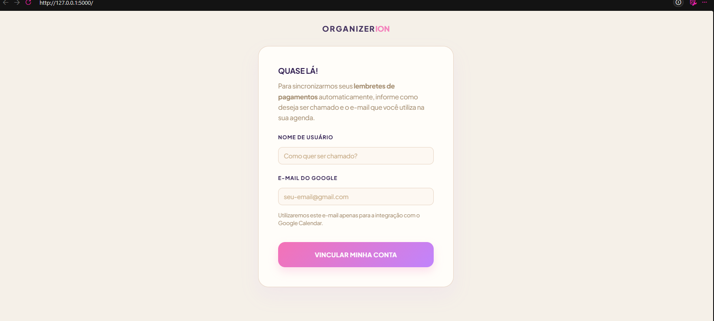
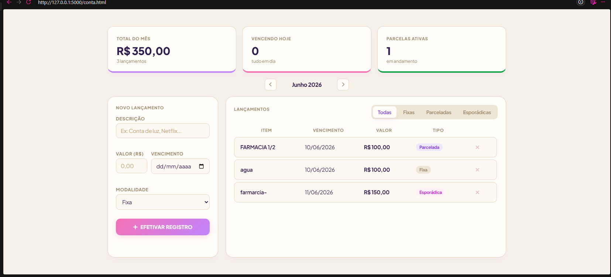
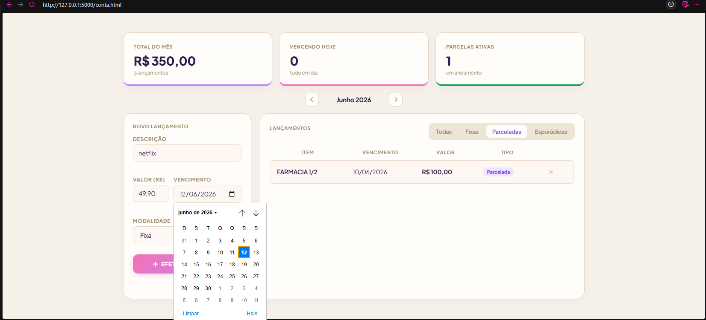
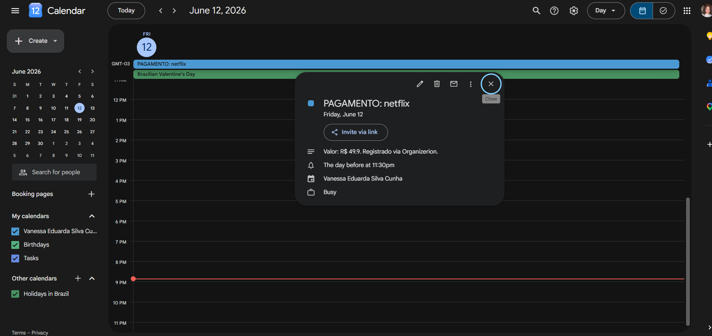

# Organizerion 

Eu vivia esquecendo vencimento de conta. Planilha não funcionava bem pra mim e eu queria algo mais visual, que aparecesse no celular. A solução mais viável foi integrar com o Google Agenda, que já uso no dia a dia, pra receber os lembretes automaticamente.

O Organizerion é um sistema de controle financeiro pessoal onde você cadastra suas contas a pagar e receber, e ele cria os eventos de vencimento direto na sua agenda.

## Funcionalidades

- Cadastro de contas fixas, parceladas e esporádicas
- Painel com total do mês, contas vencendo hoje e parcelas ativas
- Filtro por modalidade
- Integração com Google Calendar API — o lembrete aparece no seu celular automaticamente
- Armazenamento local com SQLite

## Tecnologias

- Python
- SQLite
- Google Calendar API
- HTML/CSS/JavaScript (frontend)
- Git e GitHub

## O que aprendi

Esse projeto é um CRUD, mas organizar um CRUD de verdade foi mais difícil do que parece. Fiquei horas tentando fazer o frontend conversar com o backend de forma funcional. Foi onde aprendi na prática como funciona uma API, como estruturar um banco SQLite e como as operações de criar, ler, atualizar e deletar se conectam com a interface.

A integração com o Google Calendar foi o ponto mais trabalhoso entender o fluxo de autenticação e fazer o evento aparecer na agenda certa levou bastante tentativa e erro.

## Demonstração

## Autora

Vanessa Eduarda Silva Cunha